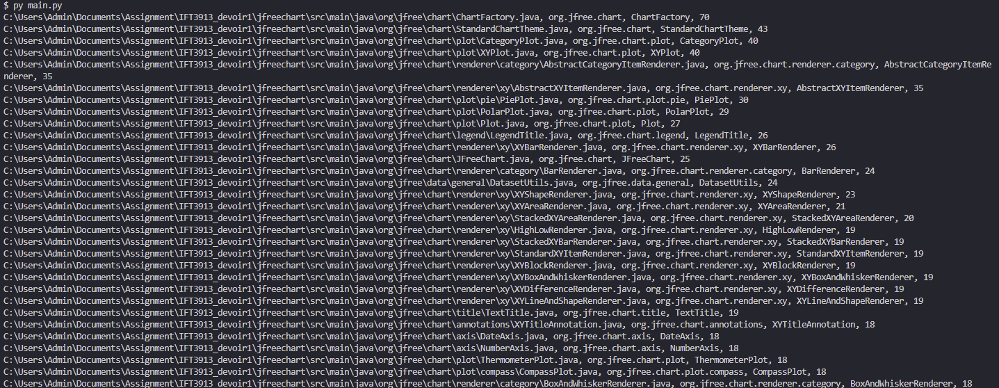

# IFT3913_TP2

## Membres de l'équipe:
- Rosine Rolande Simo Tegninko 20183729
- Yu Deng 20151659

## JFreeChart example
- Téléchargez et exécutez l'application de démonstration JFreeChart
- Cliquez sur ce file pour télécharger un fichier jar exécutable qui illustre certaines des fonctionnalités de JFreeChart  file:
`jfreechart-demo-1.5.2-jar-with-dependencies.jar`
- Vous pouvez ensuite l'exécuter sur la ligne de commande en tapant :
`java -jar jfreechart-demo-1.5.2-jar-with-dependencies.jar`

## lcsec
- Vous pouvez utiliser ce fichier pour obtenir le CSEC
>`lcsec/main.py` -  Lorsqu'elle est appelée, la fonction attend le chemin du dossier comme argument d'entrée et renvoie `list` de `dict`s qui contient le `file_path`, `filename`, `class name` et la valeur correspondante `csec`
- Function to test the running of the Program

The snapshot of the output below proves it produced an accurate output

## Notre propre implémentation
- Utiliser un fichier `code_line.py` pour tester le nombre de lignes de code
- Il suffit de mettre le dossier `jfreechart-master` et le `code_line.py` dans le même répertoire pour tester

## Tests supplémentaires
- On peut se référer aux deux images `Capture1.JPG` et `Capture2.JPG`, qui testent le code global à l'aide de l'outil sonarQube.

## LCOM
- Commencez par le fichier `LCOM.java` (situé dans le dossier `lcom`). Vous pouvez exécuter le programme en exécutant le fichier `LCOM.java` avec deux paramètres -i et -o pour le chemin du dossier du code source d'entrée et le chemin du dossier de sortie respectivement.
- Cet outil de mesure vient de https://github.com/tushartushar/LCOM.git
